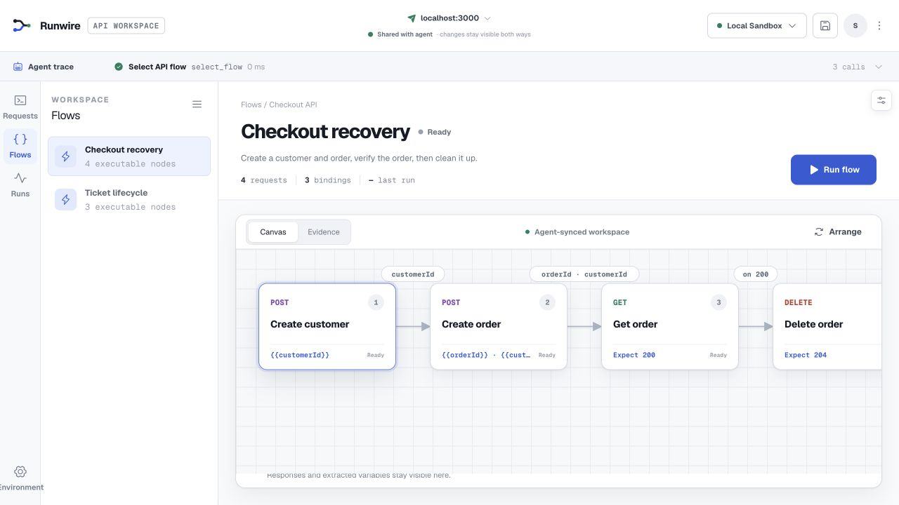
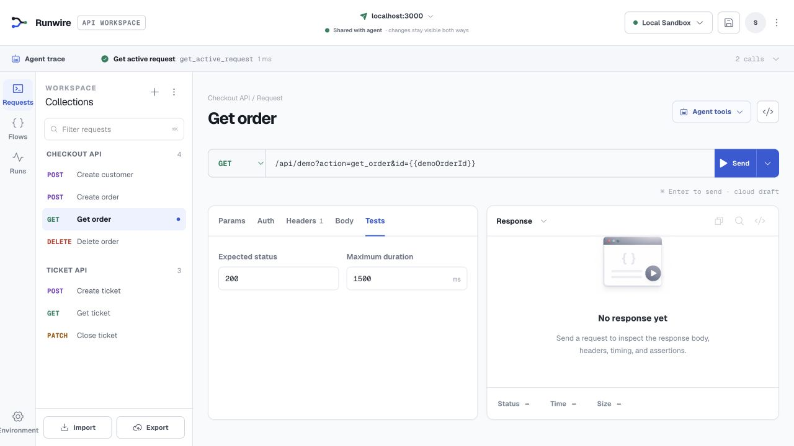
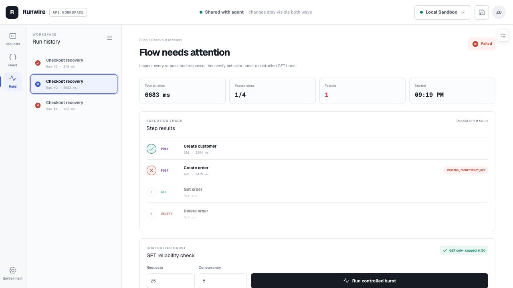
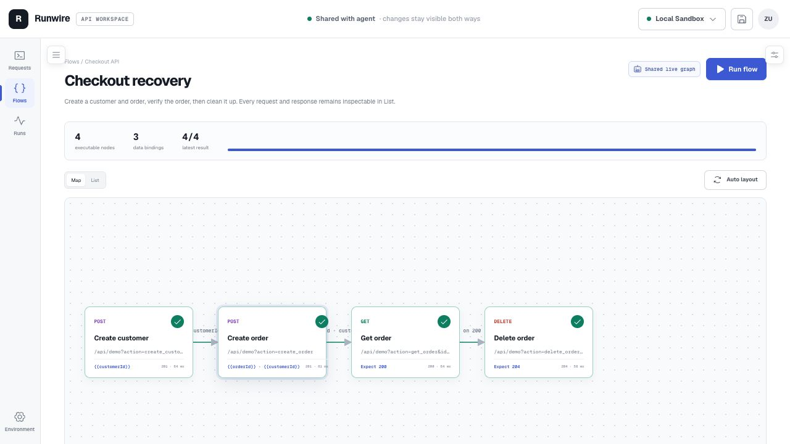
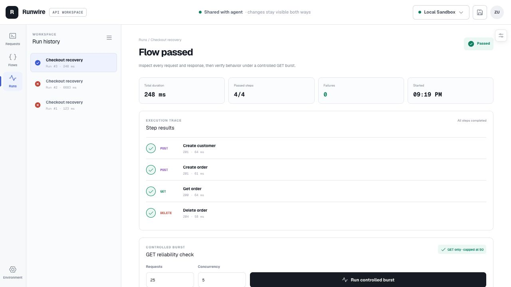

# Runwire

**Wire it. Run it. Repair it.**

[Live app](https://journey-api-workspace.zaidulhassan.chatgpt.site) · Built for [The WebMCP Challenge](https://webmcp.devpost.com/)

[2:35 judge demo script](DEMO.md)



Runwire combines a focused API client, executable multi-step flows, visible run evidence, and a WebMCP tool surface. A developer can edit and inspect requests in the UI while an agent selects flows, runs them, follows extracted values, diagnoses failures, applies safe repairs, and leaves every result visible on the same page.

## Product evidence

| Shared request workspace | Failure evidence |
| --- | --- |
|  |  |

| Repaired flow | Durable passing run |
| --- | --- |
|  |  |

## Why WebMCP

Traditional browser agents must infer API-client controls from pixels and DOM structure. Runwire exposes the actual product operations as structured tools while keeping the UI as the shared source of truth.

That makes this workflow possible:

1. A person opens an API flow and sees its requests, bindings, and expectations.
2. An agent requests the same visible flow through WebMCP, and Runwire pauses for human approval before network execution.
3. Runwire extracts response values such as `customerId` or `ticketId` and passes them into later requests.
4. When a request fails, the agent reads the real response, applies a bounded repair, and reruns the flow.
5. The person watches each WebMCP tool call, safe input summary, status, and duration in the live Agent Trace, then inspects every request and response in the UI.

## Demonstrated flows

### Ticket lifecycle

`Create ticket → Get ticket → Close ticket`

- Extracts `ticketId` from the `201` response.
- Injects the same ID into the following GET and PATCH requests.
- Expected result: `201 → 200 → 200`.

### Checkout recovery

`Create customer → Create order → Get order → Delete order`

- Extracts and forwards `customerId` and `orderId`.
- Deliberately fails order creation without an idempotency key.
- Exposes the `MISSING_IDEMPOTENCY_KEY` response to the agent.
- Lets the agent apply the missing header and rerun successfully.
- Expected repaired result: `201 → 201 → 200 → 204`.

## WebMCP tools

Runwire registers 15 page tools through `document.modelContext.registerTool`:

| Area | Tools |
| --- | --- |
| Requests | `get_active_request`, `run_active_request`, `update_active_request`, `get_last_response` |
| Flows | `select_flow`, `get_journey`, `run_journey`, `select_journey_step` |
| Visual map | `get_flow_map`, `move_flow_node`, `auto_layout_flow` |
| Recovery and testing | `apply_idempotency_repair`, `run_controlled_burst`, `get_run_history` |
| Environment | `set_environment_variable` |

Read-only tools are annotated accordingly. Sensitive authentication values are never returned to agents, and changing a request URL clears protected credentials.

Every invocation is also recorded in the visible Agent Trace. Request bodies, query values, environment values, and tool outputs are excluded from the trace; it shows only safe intent and execution status. Its **Tool calls / API flow** toggle connects `run_journey` to the actual request sequence, extracted-value edges, response codes, and durations. Agent-triggered request, flow, and burst execution waits for explicit human approval in that same trace.

## API workspace features

- Send GET, POST, PUT, PATCH, and DELETE requests.
- Query parameters, headers, JSON bodies, and expected-status assertions.
- Bearer token, API key, and Basic authentication.
- Named environment variables with `{{variable}}` resolution.
- Postman Collection v2.1 import and export.
- Executable flows with JSON-path extraction and variable chaining.
- Canvas and Evidence views backed by the same flow model.
- Per-step request, response, status, duration, and extraction evidence.
- Live WebMCP Agent Trace with human approval, safe history, and an animated tool-to-API execution flow.
- Bounded GET burst testing with success rate, p50, p95, and errors.
- Persistent workspaces and run history through D1.

## Safety boundaries

Runwire treats arbitrary API execution as a trust boundary:

- Only public HTTP and HTTPS destinations are allowed.
- Localhost, private-network, and cloud-metadata targets are blocked.
- Cross-origin redirects are blocked so credentials cannot follow them.
- Secret-like environment variables and authentication values stay outside persistence and WebMCP responses.
- Agent-triggered network execution pauses for explicit human approval; denial is recorded in the Agent Trace.
- Burst testing is GET-only and capped at 50 requests with bounded concurrency.

## Run locally

Requirements: Node.js 22.13 or newer.

```bash
npm install
npm run dev
```

Open `http://localhost:3000`.

Validation:

```bash
npm test
npm run lint
npm run typecheck
npm run build
```

To test WebMCP, open Runwire in ChatGPT's in-app browser or enable WebMCP testing in Chrome.

## Stack

- React 19 and Next.js 16
- Vinext and Vite for Cloudflare-compatible output
- WebMCP declarative tools
- Drizzle ORM with D1 persistence
- ChatGPT Sites hosting

## Project status

Runwire is a new project created during The WebMCP Challenge submission period. The current build includes the complete executable-flow demo and its WebMCP integration.
